# Document of Red black tree
## Catelog
1. Introduction
	1. Binary Search Tree (BST)
	2. Self-Balancing Binary Search Tree
	3. Terminologies
	4. Associative array
	5. Red black tree 
2. Rotation
	1. Why does it need rotation?
	2. Left Rotation
	3. Right Rotation
3. Insertion
	1. Insertion Rules
	2. Fixup for Insertion
		1. Case 1
		2. Case 2
		3. Case 3
4. Erasion
	1. Erasion Strategies
	2. Fixup for Erasion
		1. Case 1
		2. Case 2
		3. Case 3
		4. Case 4
5. Manipulations of Red black tree
6. Reference

\pagebreak

## 1. Introduction
### 1.1 Binary Search Tree (BST)
In computer science, a **binary search tree** is a data structure called **binary tree** that each internal node stores a key greater than all the keys in the node's left subtree and less than those in its right subtree.

It is also called **ordered**/**sorted** binary tree so that it can provide **search** function to find a particular key in the tree. (That is why we call it binary search tree.)

|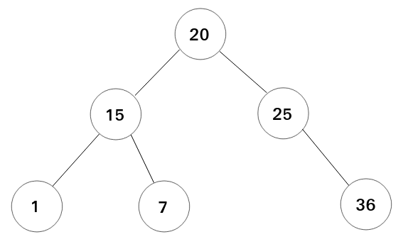|
|:---:|
|**fig1-1-1**: A simple binary search tree.|


For an ideal binary search tree, whose height is logarithm of number of nodes in the tree, the operations including insert, delete and search have a best time complexity $O(log(n))$.

### 1.2 Self-Balancing Binary Search Tree
If it has no optimization for a binary search tree, it may occur **imbalance** in the tree.

For example, Assume that we create an empty tree and insert some data(or keys) in order, the bianry search tree will be a **skewed tree** then causing the time complexity of operations, such as insert, delete and search, becomes $O(n)$. When it occurs, it is an **imbalanced** binary search tree. **Notice that imbalance may occur after insertion or deletion**.


|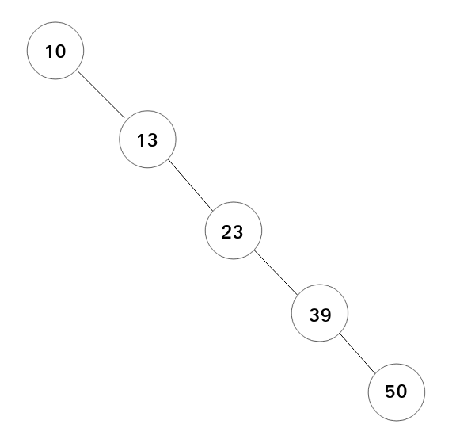|
|:---:|
|**fig1-2-1**: A skewed tree. If it inserts the data $\{10, 13, 23, 39, 50\}$ into an empty BST in order, the BST will be a bad data structure with time complexity $O(n)$ for BST operations.|


To solve imbalance, **self-balancing** binary search tree has been derived from binary search tree. **Self-balancing** binary search tree is also a binary search tree but it keeps its height as small as possible when any arbitrary insertions and deletions happens. So, the tree can always be balanced and have the time complexity $O(log(n))$ for the operations mentioned in the previous paragraph.


|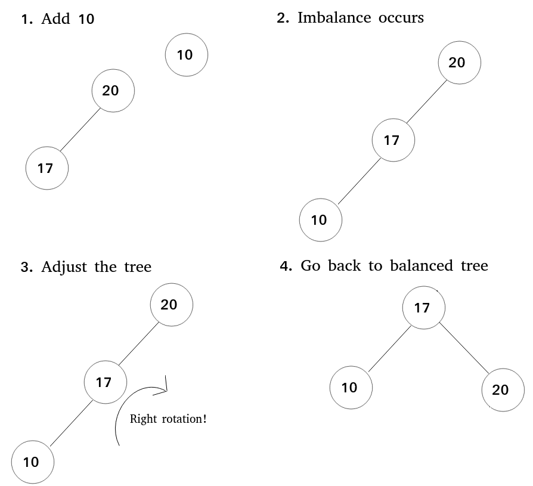|
|:---:|
|**fig1-2-2**: An example of balancing. If imbalance occurs, the tree will adjust itself by its balance rules.|


Every self-balancing BST has its own balance rules to maintain itself; here lists some known self-balancing BST for reference.

* AVL tree
* 2-3 tree
* B-tree
* **Red black tree** (The main tree in this repo.)
* Treap
* Weight-balanced tree

### 1.3 Terminologies
Because it mentions binary tree concepts in this document, users need to review the relevant terminologies about binary tree (BT). Here lists some basic terminologies.

**root**: The first node of a tree and it only exists one in the tree exactly.

**edge**: Because a tree is also a graph, so here also has the terminology **edge**, whcih is related to graph theory, and it is a connecting link between two nodes.

**leaf**: The node having no child is called **leaf**, and is also called **terminal node.**

**internal node**: It is inverse to leaf. The node having at least one child is called **internal node.**


|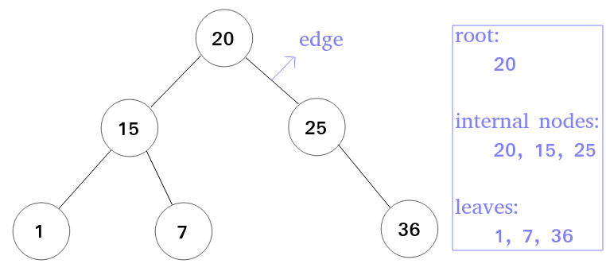|
|:---:|
|**fig1-3-1**: Illustration for root, edge, internal nodes and leaves.|


**parent**: Except for root node, for a tree structure, every node in a tree must be derived from another node, which is called **parent** node for the node.

**child**: It is corresponding to parent; If a node derives another node, then the derived node is called **child** for the node.

**siblings**: If certain nodes have same parent, they are called **sibling** for each other. For a BT, every node must have at most one sibling node exactly.


|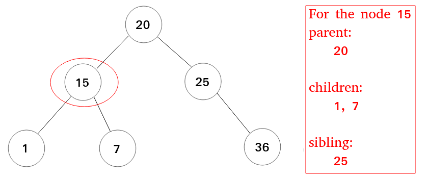|
|:---:|
|**fig1-3-2**: Illustration for parent, children and sibling for node 15.|


**path**: the sequence of nodes and edges from one node to another node is called as **path** between that two nodes.

**height**: the total number of edges from leaf node to a particular node in the longest path is called as **height** of that node.


|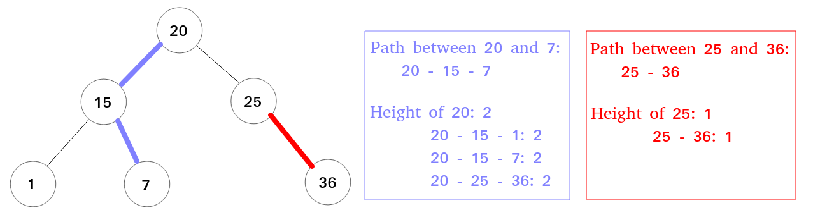|
|:---:|
|**fig1-3-3**: Illustration for path and height|


**subtree**: For every node, if it is removed, then it will form two **subtrees**, whose roots are the children of the removed node.


|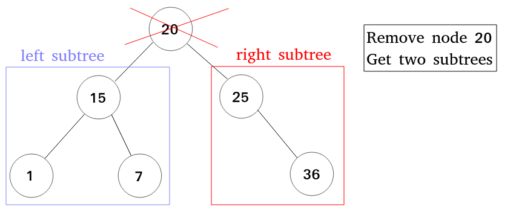|
|:---:|
|**fig1-3-4**: Illustration for subtrees. If it removes 20, two subtrees are formed and have roots 15 and 25, respectively.|


### 1.4 Associatve array
**Associative array**, which is also known as map, symbol table or dictionary, is an abstract data type storing a collection of (key, value) pairs, and each possible key just appears at most once.
By associative array, we can use "mapping" to find the association between a key and a value or build a new assoiciation.

For example: When searching a English dictionary, we often want to find the explanation of a vocabulary, and a simple English dictionary may be like the following form.

```
{
	"translation": "a process that translates something from one language to another.",
	"search": "to look somewhere carefully to find something",
	"survey": "an examination of opinions, behavior, etc."
}
```
* a simple English dictionary that has vocabularies and their explanations.

For the English dictionary, in computer science, we can store the vocabularies and explanations by building an associative array, containing key and value with string type, to stores the English dictionary.

Then, the associative array often has the following operations:
* insert(key, value): builds a new association with key and value.
* update(key, value): rebuild the association for the existed key and new value.
	* update can be integrated in the insert operation. That is, insert can also contain the behavior of update.
* search(key): search the association and return the value by giving the key.

### 1.5 Red black tree
Red black tree is a self-balancing BST that colors the nodes with red or black. The purpose of coloring the nodes is to do balancing by the number of red/black nodes.

The red black tree has the following properties:
1. Every node is either red or black.
2. All leaves must be black, and the leaves are called NIL nodes
3. A red node must have no red child node.
4. Given a node, the paths from the node to any of its descendant NIL nodes must have the same number of black nodes.
5. The root is black.


|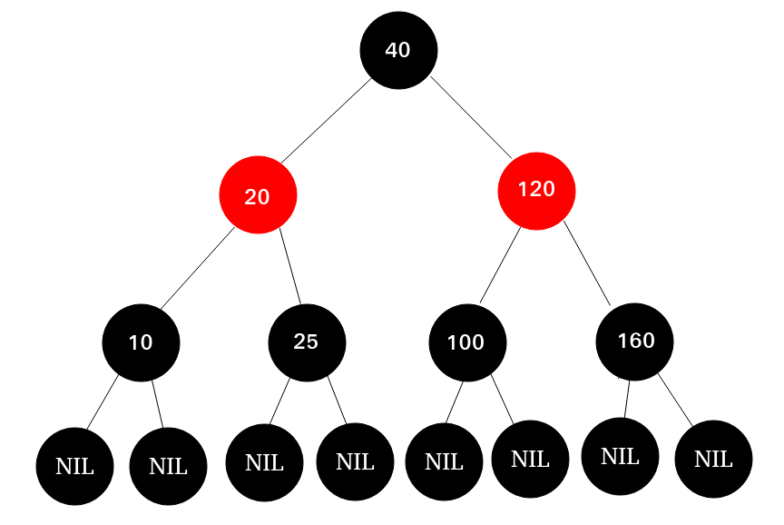|
|:---:|
|**fig1-5-1**: A red black tree|


For a binary search tree, in the implementation, each node will be created by dynamic memory allocation, such as malloc in C or new in C++. However, the red black tree needs to create NIL node to reach its the property (property 2.), and NIL node doesn't have any data. If creating many NIL nodes directly after large times of insertions, it must waste considerable memory to let all terminal nodes, which contains useful data, have NIL child nodes.

In order to save memory usage, we can just create only one NIL node and let all terminal nodes' child pointers be pointed to the NIL node. By this way, we can implement the property 2 of red black tree with very little cost of memory usage.


|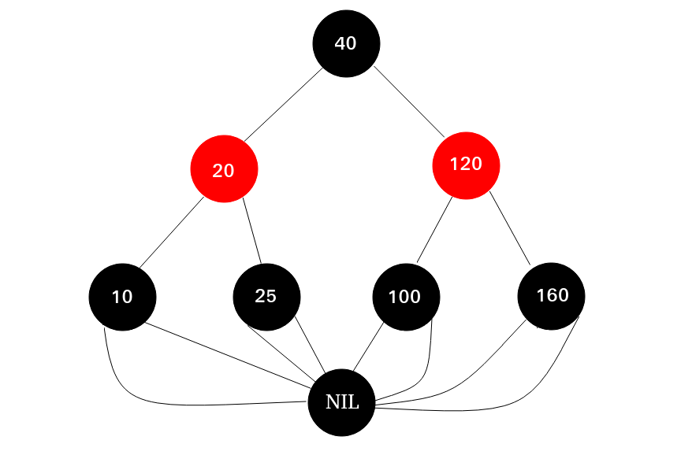|
|:---:|
|**fig1-5-2**: A red black tree in the implementation. Notice that the child pointers of the terminal nodes (not NIL nodes) will be pointed to a NIL node.|


\pagebreak

## 2. Rotation
### 2.1 Why does it need rotation?
For any self-balancing BST, how does it keep its height by itself? The most common way is to do **rotation**. When imbalance occurs, self-balancing BST will check a certain node, and change the parent-child relationship between it and its children so that the height of the self-balancing BST can be reduced. Finally, by rotation, the BST can be balanced.

There have two ways to do rotation: left rotation and right rotation!
### 2.2 Left Rotation
Left rotation means that changes the parent-child relationship of a node by **counterclockwise rotation**.

Here shows fig1-1-1 again and let it add a new node with value 48.


||
|:---:|
|**fig1-1-1** in the section 1-1|


||
|:---:|
|**fig2-2-1**: Add a new node with value 48 to the binary search tree in fig1-1-1.|


When viewing the root node in fig2-2-1, you can observe that the heights between the left subtree and right subtree are different (the left subtree is 1 and right is 2.), and the imbalance occurs!
For this situation, we can do the rotation for the node 25 to let the tree be balance.


|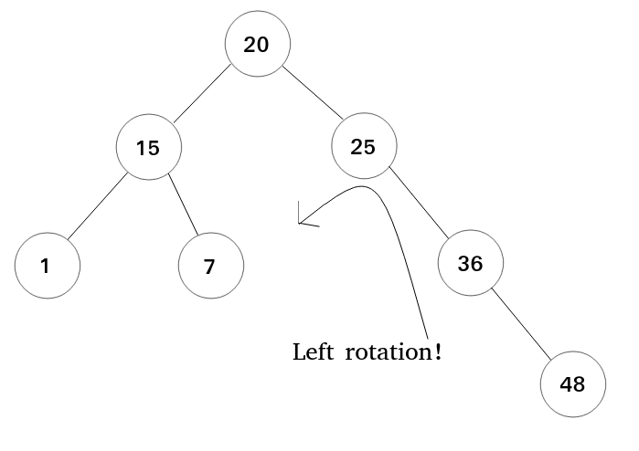|
|:---:|
|**fig2-2-2**: From the node 25, rotating it by counterclockwise.|


|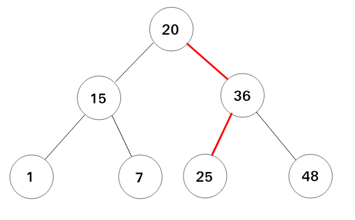|
|:---:|
|**fig2-2-3**: The balanced BST after the rotation in fig2-2-2.|


Now, here shows a more general situation to describe the entire process of rotation.


|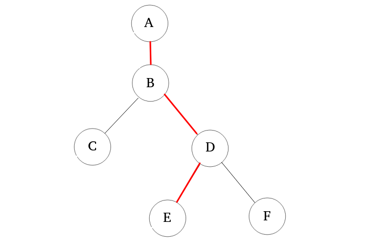|
|:---:|
|**fig2-2-4**: A partial BST.|


The image fig2-2-4 imagines there has a huge BST after many insertions or deletions. Then, the image just focuses on the certain part and draw the adjancent nodes in a BST.
Next, you can see the 3 red edges in fig2-2-4, and there have four nodes {A, B, D, E} which are linked by the red edges. So, how to do the left rotation? The answer is **changing the links between the four nodes {A, B, D, E}**.

The following steps show the entire process of left rotation and it will look at the node B to rorate and means "left rotation for the node B".
1. Let the node D be the child of node A.


|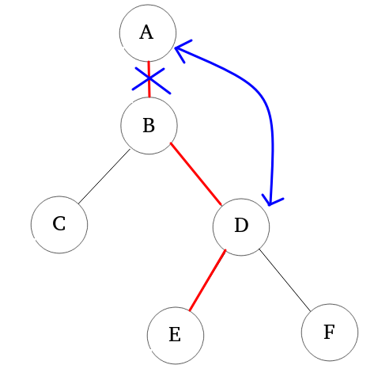|
|:---:|
|**fig2-2-5-1-1**: the illustration of rebuilding the links between A, B and D.|


|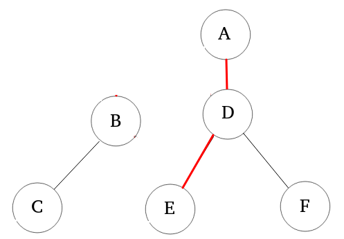|
|:---:|
|**fig2-2-5-1-2**: After first rebuilding, A has the new child D, and the subtree with root B is isolated temporarily.|


The above two images shows the process of rebuilding the links between A, B and D. B may be the left or right child of A, and just unlink between A and B (but, it is very important that the child is left or right and must be recorded). 

Then, rebuild the link between A and D to finish the first step. When linking A and D, D must be the left child if B is the left child of A before unlinking. Otherwise, D must be the right child if B is right child, originally. Finally, the link between B and D will also be deleted.

2. Let the node B has the child E.


|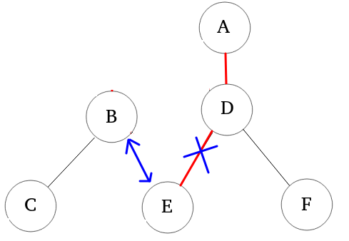|
|:---:|
|**fig2-2-5-2-1**: the illustration of rebuilding the links between B, D and E.|


|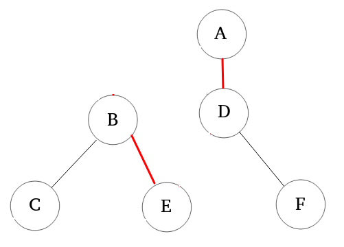|
|:---:|
|**fig2-2-5-2-2**: After the second rebuilding, B has the new child E, and the subtree with root B is still isolated temporarily.|


Second, Let's rebuild the links between B, D and E. After the first step, B has lost its right child, and then let the E be the B's right child and cancel the links between D and E. Finally, the B has the new child node and E has a new parent B, and D loses its left child.

3. Let the node B be the left child of node D.


|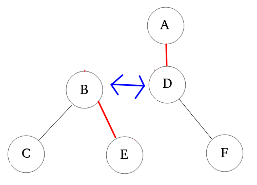|
|:---:|
|**fig2-2-5-3-1**: the illustration of rebuilding the links between B and D.|


|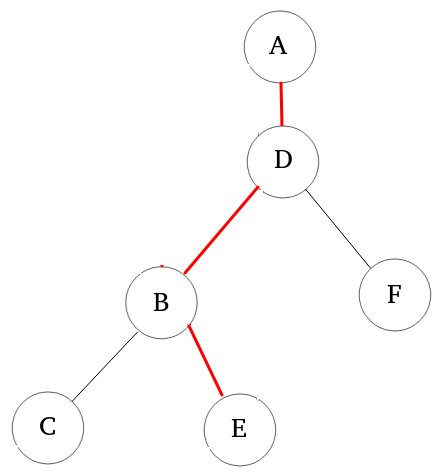|
|:---:|
|**fig2-2-5-3-2**: After the final rebuilding, the left rotation finishs and the result is showed in the image.|


Finally, let B be the left child of D. the entire process of left rotation finishs!

### 2.3 Right Rotation
Oppositely, right rotation changes the parent-child relationship of a node by **clockwise rotation**.
The process of right rotation is oppsite to left rotation. Just inverts the operations for the steps of left rotation, the steps of right rotation will also be performed.

\pagebreak

## 3. Insertion
### 3.1 Insertion Rules
Because red black tree is also a BST, the steps of insertions is identified as a general BST insertion, **but the nodes will be colored with red in the beginning**.
After the insertion, if the current red black tree violates its maintaining rules, the red black tree must be fixup.

Now, here shows the all possible situations if the red black tree is illegal after the insertions and the fixup strategies.

### 3.2 Fixup for Insertion
#### 3.2.1 Case 1
#### 3.2.2 Case 2
#### 3.2.3 Case 3
## 4. Erasion
### 4.1 Erasion Strategies
### 4.2 Fixup for Erasion
#### 4.2.1 Case 1
#### 4.2.2 Case 2
#### 4.2.3 Case 3
#### 4.2.4 Case 4
## 5. Manipulations of Red black tree
## 6. Reference
* [BTech Smart Class - binary-tree](http://www.btechsmartclass.com/data_structures/binary-tree.html)
* [Wiki - Binary search tree](https://en.wikipedia.org/wiki/Binary_search_tree)
* [Wiki - Self-balancing binary search tree](https://en.wikipedia.org/wiki/Self-balancing_binary_search_tree)
